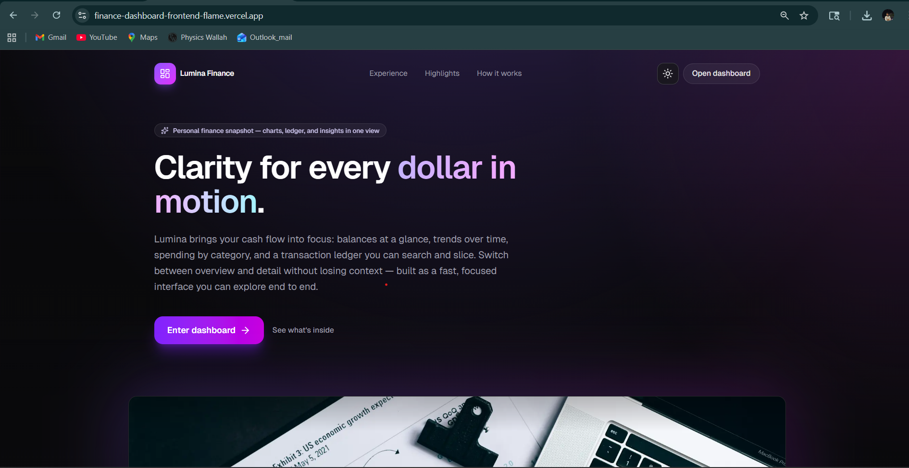
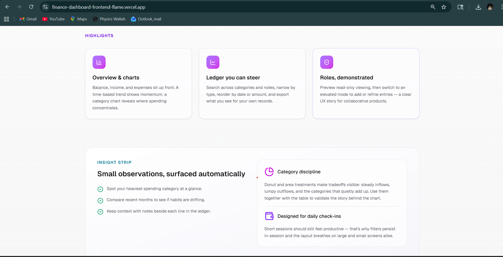
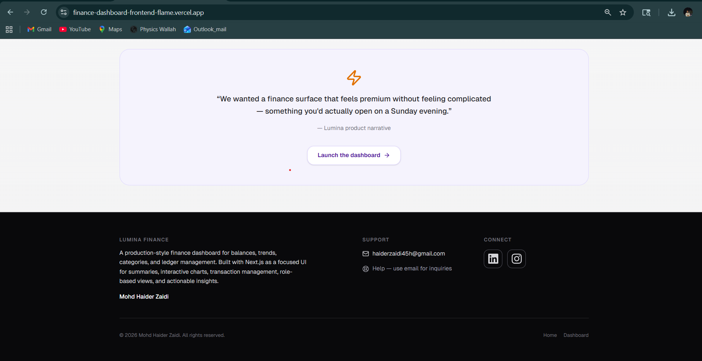

<div align="center">

# Lumina Finance

### *Clarity for every dollar in motion.*

A calm, interactive **personal finance dashboard** — summaries, charts, ledger, and insights in one place.  
Built with **Next.js** & **TypeScript**; mock data only, no backend.

<br />

[](https://nextjs.org/)
[](https://www.typescriptlang.org/)
[](https://react.dev/)
[](https://tailwindcss.com/)

<br />

[**Live preview**](https://finance-dashboard-frontend-flame.vercel.app/) · [`/dashboard`](https://finance-dashboard-frontend-flame.vercel.app/dashboard)

</div>

---

## Preview

<p align="center">
  
</p>
<p align="center">
  
</p>
<p align="center">
  
</p>

<p align="center"><sub>Screenshots · commit <code>public/images/*.png</code> so they load on GitHub</sub></p>

---

## Why Lumina

| | |
|:---|:---|
| **Overview** | Balance, income, and expenses at a glance — plus balance trend and spending-by-category views. |
| **Ledger** | Search, filter by category and type, sort by date, amount, category, or type. |
| **Roles** | **Viewer** is read-only; **Admin** can add and edit transactions (frontend-simulated roles). |
| **Insights** | Highest spending category, month-over-month comparison, and portfolio-style observations. |
| **Polish** | Light & dark themes, responsive layout, thoughtful empty states, CSV/JSON export. |

---

## Quick start

```bash
git clone <your-repo-url>
cd finance-dashboard
npm install
npm run dev
```

Open [**http://localhost:3000**](http://localhost:3000) for the landing page, then **Enter dashboard** or navigate to **`/dashboard`**.

**Production build**

```bash
npm run build
npm start
```

---

## Tech stack

| Layer | Choices |
|:------|:--------|
| **Framework** | Next.js 16 (App Router), React 19 |
| **Language** | TypeScript |
| **Styling** | Tailwind CSS v4 |
| **Charts** | Recharts |
| **State** | Zustand + `persist` (transactions & role → `localStorage`) |
| **Theming** | `next-themes` + custom `dark` variant in `app/globals.css` |
| **Icons** | Lucide React |

---

## Project layout

```
app/
  page.tsx              # Landing
  dashboard/page.tsx    # Dashboard shell
  layout.tsx            # Root layout, theme, footer
components/
  dashboard/            # Charts, cards, ledger, insights, modals
  site-footer.tsx
lib/
  store.ts              # Zustand store & filter/sort helpers
  finance-helpers.ts    # Aggregations for charts & insights
  site-config.ts        # Footer / social links
data/
  initial-transactions.json   # Seed mock ledger
```

---

## Assignment & feature checklist

Built to satisfy a **Finance Dashboard UI** brief: frontend-only, mock data, clear UX.

| Requirement | How it’s implemented |
|:------------|:---------------------|
| Dashboard overview | `SummaryCards` — total balance, income, expenses |
| Time-based chart | Balance trend (area / line by role) |
| Category chart | Spending breakdown (donut / bars by role) |
| Transactions | Date, amount, category, type (+ note); search, filters, sort |
| Role-based UI | Viewer vs Admin toggle; add/edit only as Admin |
| Insights | Top category, monthly comparison, snapshot copy |
| State | Transactions, filters, sort, role in Zustand |
| UX | Responsive, readable type, empty & “no matches” states |

**Optional extras included:** dark mode, `localStorage` persistence, CSV/JSON export, landing polish.

---

## Configuration

| Topic | Where to look |
|:------|:--------------|
| **Mock data** | `data/initial-transactions.json` |
| **Reset demo** | Footer control (restores seed after local experiments) |
| **Footer & socials** | `lib/site-config.ts` or `NEXT_PUBLIC_LINKEDIN_URL`, `NEXT_PUBLIC_INSTAGRAM_URL` in `.env.local` |
| **Persisted storage key** | `finance-dashboard-storage` in `localStorage` |

---

## Implementation notes

<details>
<summary><strong>Charts & SSR</strong></summary>

Recharts is loaded with `next/dynamic` and `{ ssr: false }` so layout measurement stays accurate in the browser.

</details>

<details>
<summary><strong>Theme & <code>dark:</code> utilities</strong></summary>

Tailwind v4’s default `dark:` variant follows system preference. This project adds:

`@custom-variant dark (&:where(.dark, .dark *));`

so the manual theme toggle (class on `<html>`) drives `dark:` styles consistently.

</details>

<details>
<summary><strong>Zustand selectors</strong></summary>

`computeFilteredSortedTransactions` runs inside `useMemo` with plain store fields — not as a selector that returns a new array each tick — to avoid React 19 / `useSyncExternalStore` snapshot churn.

</details>

---

<div align="center">

**Lumina Finance** — a small interface for a noisy problem.

<br />

<sub>Made with care · Next.js · TypeScript · Tailwind</sub>

</div>
